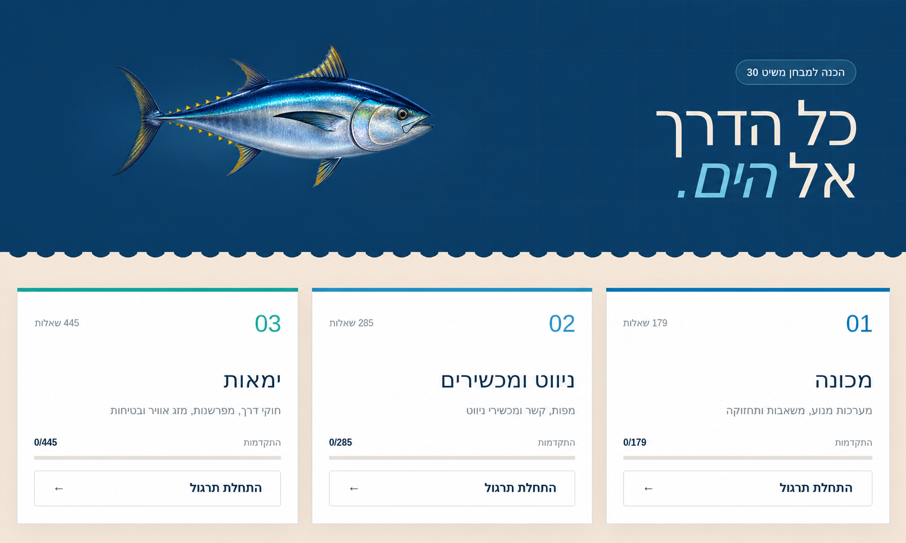

<div align="center">

# Skipper 30 Quiz 🌊

### Interactive preparation for Israel's Skipper 30 exam

A complete Hebrew question bank with Russian and English translation help and a mobile-first practice experience.

[**Open the app**](https://mitkonenim-layam.sapirp.chatgpt.site)


</div>



---

## About

**Skipper 30 Quiz** is a web application for practicing questions for Israel's Skipper 30 exam. Choose a subject, work through every question in a randomized order, and use optional Russian or English translations beneath each question when needed.

Progress resets whenever the page is refreshed. Questions and answer choices are shuffled once at the beginning of each new session. Their order remains stable while navigating backward and forward through that session.

## Features

- **909 unique questions** across three subjects
- **179** engine questions
- **285** navigation and instruments questions
- **445** seamanship questions
- **202 original images** embedded in relevant questions
- Correct and incorrect answers highlighted immediately after selection
- Optional, non-interactive Russian and English translations for all questions and answers
- Previous and Next navigation available throughout a session
- Selected answers and answer order preserved when revisiting questions
- Independent question and answer randomization at the start of every session
- Unrestricted access to every question in the selected subject
- Tap-to-enlarge question images with lazy loading
- Complete Hebrew and right-to-left interface support
- Responsive layouts for iPhone, iPad, and Android devices
- Landscape orientation and safe-area support
- Accessible touch targets and accidental-exit protection
- Service Worker caching for repeat use on slow or interrupted connections

## How It Works

1. Select one of the three exam subjects.
2. The app shuffles all questions and their answer choices once for that session.
3. Open **Перевод на русский** or **Translation to English** when translation help is useful.
4. Select an answer to reveal whether it is correct.
5. Use Previous and Next to move through the stable session order.
6. Continue until you have completed the entire subject bank.

## Local Development

### Requirements

- Node.js `22.13.0` or later
- npm

### Setup

```bash
npm install
npm run dev
```

The development URL will be displayed in your terminal.

### Commands

| Command | Description |
|---|---|
| `npm run dev` | Start the local development server |
| `npm run build` | Create a production-ready build |
| `npm test` | Build and run the project tests |
| `npm run lint` | Check code quality |

## Project Structure

```text
app/
├── quiz-app.tsx       # Quiz interface and application logic
├── questions.json     # Complete 909-question bank
├── questions.en.json  # English question and answer translations
├── questions.ru.json  # Russian question and answer translations
├── globals.css        # Responsive styling and animations
└── layout.tsx         # Application shell and viewport metadata
public/
├── question-images/   # Images used by the questions
├── tuna.png           # Animated tuna illustration
└── sw.js              # Offline cache service worker
tests/                 # Rendering and translation coverage tests
scripts/
└── translate_questions.mjs # Regenerate Russian or English translations
```

## Technology

- [React 19](https://react.dev/)
- [TypeScript](https://www.typescriptlang.org/)
- [vinext](https://github.com/cloudflare/vinext)
- [Vite](https://vite.dev/)
- [Cloudflare Workers](https://developers.cloudflare.com/workers/)

## Question Data

The question bank was extracted from three Word documents. Answers highlighted with a green background in the source documents were recorded as correct. Duplicate questions were removed, and the original question images were preserved.

Translations are stored in `app/questions.ru.json` and `app/questions.en.json`, keyed by question ID and the original Hebrew answer text. Regenerate Russian with `node scripts/translate_questions.mjs` and English with `node scripts/translate_questions.mjs en`. These commands send the Hebrew question bank to Google Translate and replace the selected translation file, so review the resulting nautical terminology before publishing.

> This application is an independent study aid and is not an official website of Israel's Shipping and Ports Administration.

---

<div align="center">

Built to make the path to the exam clearer—and bring you a little closer to the sea.

</div>
